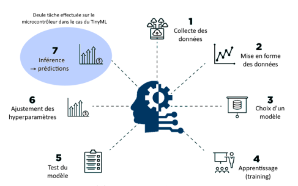
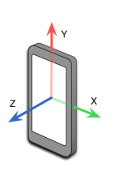
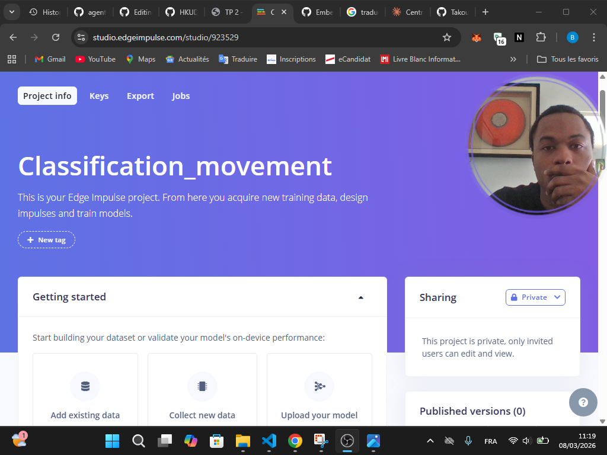
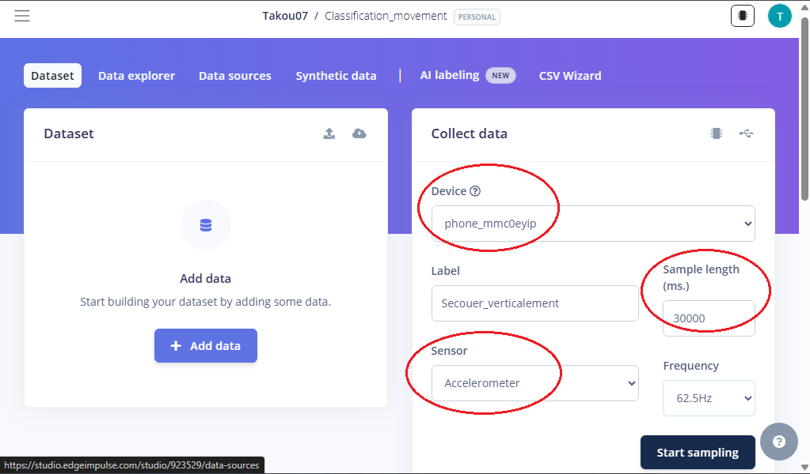
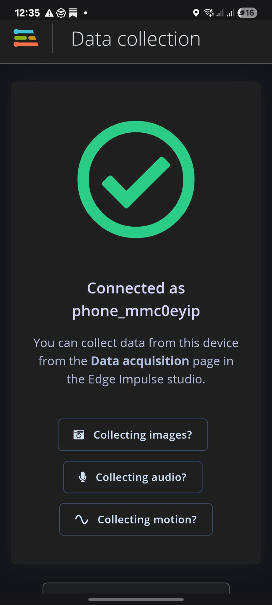
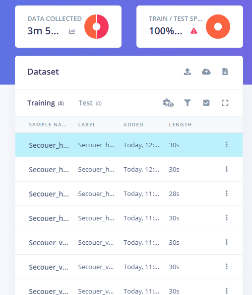
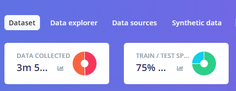
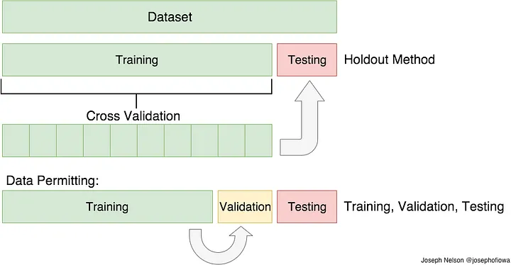

  

<h2 align="center">Etudes de Cas du TinyML-IA EMBARQUEE : Cas de la classification associé à des mouvements du smartphone.</h2>

  <strong>Developper un TinyModel à travers la plateforme EDGE IMPULSE pour pouvoir détecter si le mouvement de mon téléphone est horizontal ou vertical </strong>

  <a href="#Apercu">Overview</a> •
  <a href="#TINYML – IA EMBARQUEE">TINYML </a> •
  <a href="# Prérequis">Prérequis</a> •
  <a href="#Détection Mouvement Horizontal ou Vertical">Implementation</a> •
  <a href="#installation--usage">Installation & Usage</a> •
  <a href="#troubleshooting">Troubleshooting</a>

## Apercu
Ce répertoire montre comment j'ai construit un **Tinymodel** en utilisant la plateforme **edge impulse** qui est une  plateforme
de développement pour l'apprentissage automatique sur les dispositifs embarqués. Ce projet est le premier d'une longue liste d'expérimentations sur le sujet de TinyML que je viens de découvrir et qui m'intéresse de plus en plus.

## TINYML – IA EMBARQUEE

  

**TinyML** désigne l'implémentation de modèles d'apprentissage automatique (Machine
Learning) sur des dispositifs embarqués à faible consommation d'énergie, permettant
l'exécution de tâches d'IA directement sur des appareils tels que des microcontrôleurs

| Avantages | Inconvénients |
|---|---|
|Faible consommation d'énergie | Capacité limitée : Les ressources en mémoire et en puissance de calcul sont restreintes.
|Latence réduite : Les calculs locaux éliminent le besoin de transmission vers le cloud.|Performances moindres : Les modèles doivent souvent être simplifiés, ce qui peut réduire leur précision. 
|Portabilité : Permet l'intégration dans de petits appareils non connectés ou dans des endroits isolés.| Domaine émergent : Moins de standardisation et d'outils matures par rapport à l'IA traditionnelle (pour le moment)

## Prérequis
- Avoir un Smartphone iOS ou Android

## Détection Mouvement Horizontal ou Vertical

### Acquisition des données avec ton Smartphone

Nos smartphones pssèdent une **centrale inertielle** (IMU - Inertial Measurement Unit) qui regroupe plusieurs capteurs : 

- Accéléromètre — mesure les accélérations linéaires (mouvements, gravité)
- Gyroscope — mesure la vitesse de rotation angulaire
- Magnétomètre — mesure le champ magnétique (boussole)

Dans ce projet le capteur qui sera utilisé pour la détection des données sera la **Accéléromètre** qui va mesurer l'accélération linéaire sur 3 axes (X, Y, Z) en m/s² ou en g

  

Comme nous allons ici résoudre un problème de classification associé à des mouvements du smartphone, créons d'abord le projet dans **Edge Impulse**

  

Les 2 mouvements (qui seront 2 classes) qu'on va  distinguer seront : 
- Secouer l'appareil verticalement
- Secouer l'appareil horizontalement

Nous allons pour commencer acquérir des données qui serviront plus tard à entrainer le modèle d'IA. Ces données seront acquises grâce à la centrale inertielle (accéléromètre + gyroscope) de votre smartphone. L'ensemble des données acquises sera nommé dataset.

- Dans la fenêtre d'acquisition des données choisir une durée d'acquisition de 30 s = 30 000 ms
- Choisir l'accéléromètre du smartphone comme capteur à enregistrer. Donner un label = nom à une première classe de mouvement : "secouer
verticalement".

  

- l'acquisition du signal démarre automatiquement au bout de
quelques secondes sur le smartphone

  

**NB**: Pour obtenir le max de données possible necessaire à entrainé notre modèle on fera 4 acquistions de 30s pour chaque classe à savoir : Secouer_horizontalement et secouer_verticalement.

- A la fin de l'acquisition, l'échantillon (la mesure effectuée) on obtient 2 dataset qui correspond chacun à un label et une courbe l'évolution temporelle des accélérations mesurées suivant les trois directions

  

Après avoir acquis tout les données necessaires nous allons spliter les données en 2 ensembles : 
- Données d'entrainement (environ 75% du dataset) → Entrainement du modèle d'IA
- Données de test (environ 25% du dataset) → Test des performances du modèle

  

Training Set: l'ensemble complet des données d'entraînement. Vous pouvez extraire des caractéristiques et entraîner un modèle, etc.

Validation Set: Cet ensemble est crucial pour choisir les paramètres optimaux de votre estimateur. L'ensemble d'entraînement peut être divisé en un ensemble d'entraînement et un ensemble de validation. En fonction des résultats de la validation, le modèle peut être affiné (par exemple, en modifiant les paramètres ou les classificateurs). Cela nous permettra d'obtenir le modèle le plus performant.

Testing Set: Une fois le modèle obtenu, on effectue des prédictions à l'aide de ce modèle, tel qu'il a été obtenu sur l'ensemble d'entraînement.

  

### Mise en forme des données
