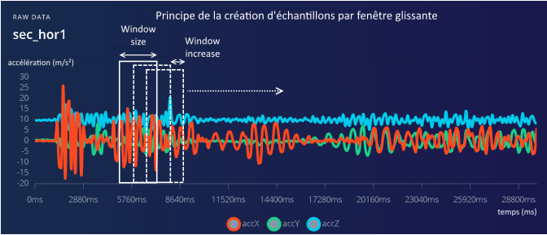
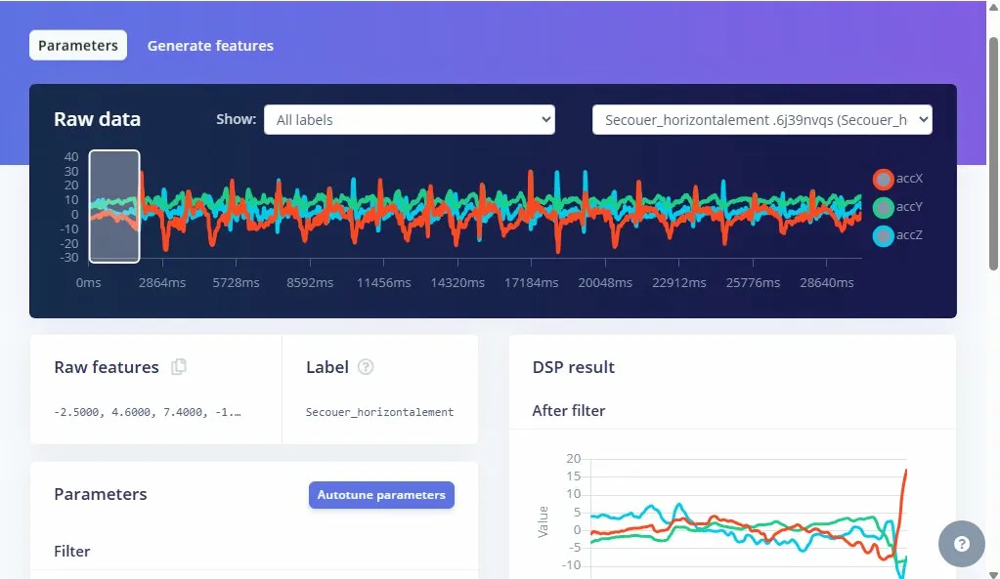
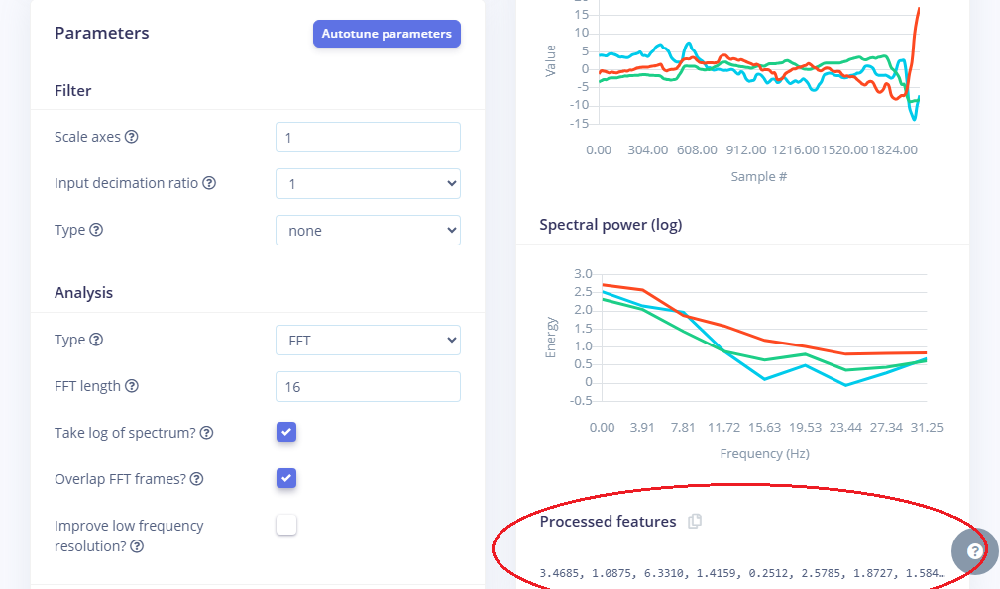
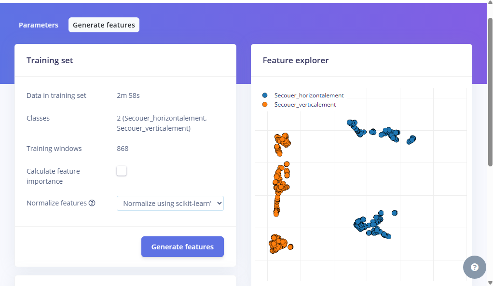
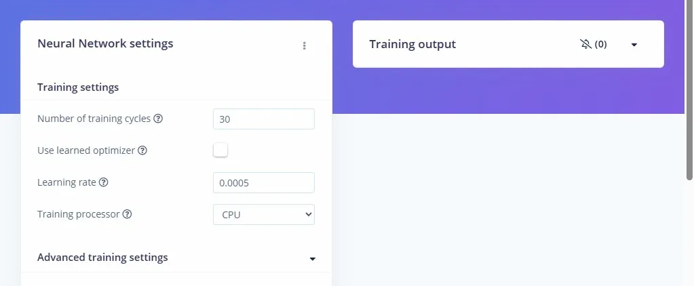
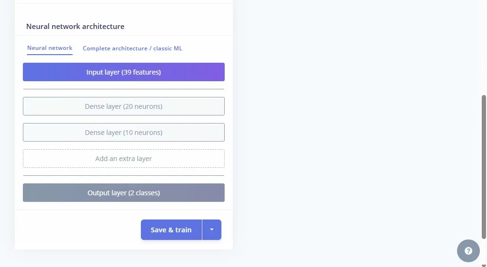
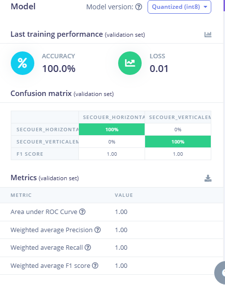
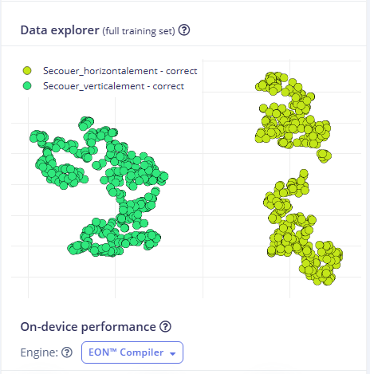
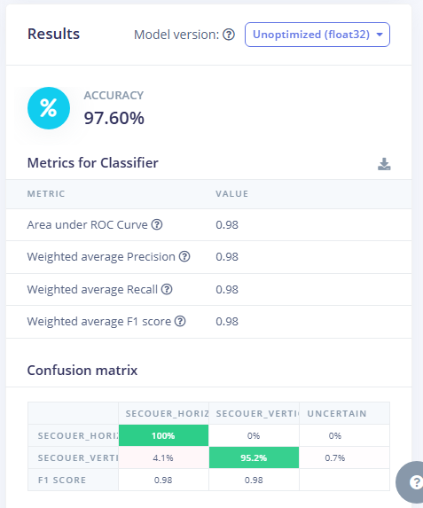
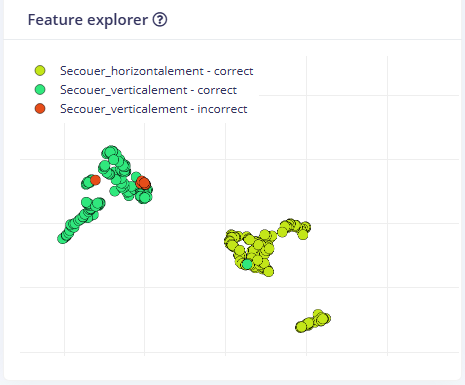

  

<h2 align="center">Etudes de Cas du TinyML-IA EMBARQUEE : Cas de la classification associé à des mouvements du smartphone.</h2>

  <strong>Developper un TinyModel à travers la plateforme EDGE IMPULSE pour pouvoir détecter si le mouvement de mon téléphone est horizontal ou vertical </strong>

  <a href="#Apercu">Overview</a> •
  <a href="#TINYML – IA EMBARQUEE">TINYML </a> •
  <a href="# Prérequis">Prérequis</a> •
  <a href="#Détection Mouvement Horizontal et Vertical">Implementation</a> •

## Apercu
Ce répertoire montre comment j'ai construit un **Tinymodel** en utilisant la plateforme **edge impulse** qui est une  plateforme
de développement pour l'apprentissage automatique sur les dispositifs embarqués. Ce projet est le premier d'une longue liste d'expérimentations sur le sujet de TinyML que je viens de découvrir et qui m'intéresse de plus en plus.

## TINYML – IA EMBARQUEE

  

**TinyML** désigne l'implémentation de modèles d'apprentissage automatique (Machine
Learning) sur des dispositifs embarqués à faible consommation d'énergie, permettant
l'exécution de tâches d'IA directement sur des appareils tels que des microcontrôleurs

| Avantages | Inconvénients |
|---|---|
|Faible consommation d'énergie | Capacité limitée : Les ressources en mémoire et en puissance de calcul sont restreintes.
|Latence réduite : Les calculs locaux éliminent le besoin de transmission vers le cloud.|Performances moindres : Les modèles doivent souvent être simplifiés, ce qui peut réduire leur précision. 
|Portabilité : Permet l'intégration dans de petits appareils non connectés ou dans des endroits isolés.| Domaine émergent : Moins de standardisation et d'outils matures par rapport à l'IA traditionnelle (pour le moment)

## Prérequis
- Avoir un Smartphone iOS ou Android

## Détection Mouvement Horizontal ou Vertical

### Acquisition des données avec ton Smartphone

Nos smartphones pssèdent une **centrale inertielle** (IMU - Inertial Measurement Unit) qui regroupe plusieurs capteurs : 

- Accéléromètre — mesure les accélérations linéaires (mouvements, gravité)
- Gyroscope — mesure la vitesse de rotation angulaire
- Magnétomètre — mesure le champ magnétique (boussole)

Dans ce projet le capteur qui sera utilisé pour la détection des données sera la **Accéléromètre** qui va mesurer l'accélération linéaire sur 3 axes (X, Y, Z) en m/s² ou en g

  

Comme nous allons ici résoudre un problème de classification associé à des mouvements du smartphone, créons d'abord le projet dans **Edge Impulse**

  

Les 2 mouvements (qui seront 2 classes) qu'on va  distinguer seront : 
- Secouer l'appareil verticalement
- Secouer l'appareil horizontalement

Nous allons pour commencer acquérir des données qui serviront plus tard à entrainer le modèle d'IA. Ces données seront acquises grâce à la centrale inertielle (accéléromètre + gyroscope) de votre smartphone. L'ensemble des données acquises sera nommé dataset.

- Dans la fenêtre d'acquisition des données choisir une durée d'acquisition de 30 s = 30 000 ms
- Choisir l'accéléromètre du smartphone comme capteur à enregistrer. Donner un label = nom à une première classe de mouvement : "secouer
verticalement".

  

- l'acquisition du signal démarre automatiquement au bout de
quelques secondes sur le smartphone

  

**NB**: Pour obtenir le max de données possible necessaire à entrainé notre modèle on fera 4 acquistions de 30s pour chaque classe à savoir : Secouer_horizontalement et secouer_verticalement.

- A la fin de l'acquisition, l'échantillon (la mesure effectuée) on obtient 2 dataset qui correspond chacun à un label et une courbe l'évolution temporelle des accélérations mesurées suivant les trois directions

  

Après avoir acquis tout les données necessaires nous allons spliter les données en 2 ensembles : 
- Données d'entrainement (environ 75% du dataset) → Entrainement du modèle d'IA
- Données de test (environ 25% du dataset) → Test des performances du modèle

  

Training Set: l'ensemble complet des données d'entraînement. Vous pouvez extraire des caractéristiques et entraîner un modèle, etc.

Validation Set: Cet ensemble est crucial pour choisir les paramètres optimaux de votre estimateur. L'ensemble d'entraînement peut être divisé en un ensemble d'entraînement et un ensemble de validation. En fonction des résultats de la validation, le modèle peut être affiné (par exemple, en modifiant les paramètres ou les classificateurs). Cela nous permettra d'obtenir le modèle le plus performant.

Testing Set: Une fois le modèle obtenu, on effectue des prédictions à l'aide de ce modèle, tel qu'il a été obtenu sur l'ensemble d'entraînement.

  

Avant d'entraîner l'algorithme d'IA à reconnaître les différentes classes, il faut extraire, à partir des données temporelles acquises, des attributs (features) que l'on peut voir comme les "caractéristiques principales" des signaux. Les différences parmi ces attributs permettront de distinguer et de classer les différents mouvements.
Pour cela, nous allons utiliser le principe de l'analyse spectrale, qui consiste à décomposer un signal en ses différentes fréquences constitutives, permettant d'étudier leur amplitude et leur répartition. Cela est habituellement réalisé à l'aide de la transformée de Fourier pour analyser des phénomènes périodiques ou vibratoires.

#### Principe de création d'échantillon dans notre projet : Méthode de fenetre glissante

Afin de transformer le signal continu en données exploitables par le modèle, nous utilisons le principe de la **fenêtre glissante**. Cette technique consiste à découper le signal temporel en segments de taille fixe, appelés fenêtres, qui se déplacent progressivement le long du signal. Chaque fenêtre est caractérisée par deux paramètres : la taille de la fenêtre (window size), qui définit la durée de chaque segment, et le pas de déplacement (window increase), qui détermine le décalage entre deux fenêtres consécutives.
Lorsque le pas de déplacement est inférieur à la taille de la fenêtre, les fenêtres se chevauchent, ce qui permet de générer davantage d'échantillons d'entraînement et de s'assurer qu'aucun geste ne soit manqué entre deux découpes. Chaque fenêtre constitue alors un échantillon indépendant, étiqueté avec sa classe correspondante, et sera utilisé comme entrée du modèle d'apprentissage automatique.

L'image ci dessous demontre cela : 

  

#### Analyse du Spectre

  

- Dans cet image on peut voir le signal brut de "Secouer_horizontalement". La zone grisée à gauche est un morceau qui est analysé en bas dont les valeurs brutes avant tout traitement DSP 

- Après l'application du filtre on peut voit que le signal est légèrement lissé

  

Ici on peut trouver les paramètres généraux du traitement DSP :
- Aucun filtre appliqué
- Le type de traitement : FFT (transformé de fourrier ) , 16 points de fréquence analysés, chevauchement des frames FFT pour plus de précision
- Sur le graphe **Spectral Power** on observe Énergie forte entre 0 et 8 Hz et une énergie qui chute après 8 Hz
- On oberse aussi Processed features qui sont les features EXTRAITES par la FFT c'est CE VECTEUR qui sera donné en entrée au modèle de classification

Ce processus est très important pour distinguer les gestes : 

- Secouer horizontalement : Énergie forte à 2-4 Hz, Pic unique                  

- Marche : Énergie forte à 1-2 Hz , Pic régulier cadencé

- Chute : Énergie sur toutes les fréquences, (choc = signal large bande)           

- Repos : Énergie quasi nulle partout
                       

On observe alors sur un graphique des ensembles de points de 2 couleurs différentes, associées aux 2 classes à classifier. , les points d'une même couleur forment des ensembles groupés(clusters). Ces attributs  révélent des différences caractéristiques entre les 2 classes.

  

### Choix du modèle

  

Paramètres d'entraînement avec le nombre d'époques qui est de 30 c'est à dire va voir l'ensemble des données 30 fois. A chaque cycle il ajuste ses poids pour mieux classifier. Le learning rate qui est de 0.0005.

  

Au niveau de l'architecture du réseau de neurones, on a :
- Une couche en entrée 
- 2 couches cachées de 20 neurones
- 1 couche Sortie de 10 neurones

### Phase d'apprentissage 

C'est à cette étape que Edge Impulse utilise entre autres un algorithme de descente de gradient pour ajuster les poids et les biais associés à chaque neurone artificiel.

  

Le modèle a ici une précision (accuracy) de 100%. Cela signifie que 1001% des échantillons des données d'entrainement ont vu leur classe de sortie prédite
correctement

Pour aller plus dans le détail, on peut observer la matrice de confusion :
- En colonnes, les classes prédites par l'algorithme.
- En lignes, les classes connues car étiquetées dans les données d'entrainement.

  

Le "Data explorer" nous permet de retrouver les échantillons pour lesquels la
prédiction a été mauvaise. Ci-contre, on peut voir qu'aucun échantillons ont vu leur classe mal prédite

### Test du modèle

On obtient un récapitulatif de performances similaire au précédent. Assez logiquement, les performances sont un peu moins satisfaisantes que sur le set de données d'entrainement (on rappelle que l'algorithme n'avais "jamais vu" les
données de test). Dans l'exemple ci-contre, la précision obtenue, supérieure à 97.60% est satisfaisante.

  

Ici le "Feature explorer" nous permet de retrouver les échantillons pour lesquels la prédiction a été mauvaise. Ci-contre, on peut voir que 6 échantillons ont vu leur classe mal prédite.

  

### Inference ➔ Predictions

On entre ici dans la phase d'utilisation (inférence) de l'algorithme d'IA qui a été précédemment entrainé et testé.

Première possibilité avec Edge Impulse : "Live Classification" – adapté au test rapide du modèle

  

A la fin de l'acquisition, la mesure apparaît à l'écran de l'ordinateur. On retrouve le découpage en plusieurs échantillons avec la méthode de la fenêtre glissante définie dans la vidéo, ce qui amène plusieurs échantillons pour une  seule mesure. Pour chaque échantillon, l'algorithme effectue une prédiction d'appartenance à une des trois classes. Cette prédiction est caractérisée par une probabilité (entre 0 et 1) d'appartenance à chaque classe.

### A faire plus tard 

Déploier mon modèle d'IA crée dans mon téléphone et l'utiliser sous forme de WebApp pour détecter les mouvements.